# L3 — Components (inside `apps/api`)

> Zoom level 3: the 19 feature modules inside the `api` container of [`containers.md`](./containers.md), grouped into 7 visual clusters by responsibility. The canonical 17-row table (with events, ports, owned Prisma models) is [`docs/architecture/context-map.md`](../context-map.md) — this picture is for layout, that table is for truth.
>
> See [`README.md`](./README.md) for how to read C4 diagrams.

---

## Diagram

```mermaid
C4Component
    title TravelSuperApp api — Components (L3)

    Container_Ext(web, "Web / Mobile / Admin", "via @app/sdk")
    ContainerDb_Ext(pg, "Postgres", "Supabase")
    ContainerDb_Ext(redis, "Redis", "Upstash")
    ContainerDb_Ext(r2, "Cloudflare R2", "Object storage")
    Container_Ext(ai_service, "ai-service", "Python · FastAPI")
    Container_Ext(workers, "Workers", "notification · media · crawler")

    Container_Boundary(api, "apps/api (NestJS modular monolith)") {

        Boundary(cluster_identity, "Identity cluster") {
            Component(identity, "identity", "NestJS module", "Auth, sessions, JWT, OIDC. Pure supplier — publishes UserRegistered / UserDeleted.")
            Component(account, "account", "NestJS module", "Self-service settings, data export, account deletion (GDPR Art. 15-21).")
        }

        Boundary(cluster_trip, "Trip cluster") {
            Component(trip, "trip", "NestJS module", "Itinerary aggregate. Versioning, lock, publish, archive. Consumer-hub.")
            Component(diary, "diary", "NestJS module", "Live companion. Geofence + re-plan triggers. LLM-driven diary writer.")
        }

        Boundary(cluster_place, "Place-discovery cluster") {
            Component(places, "places", "NestJS module", "Federated catalog (Google + FSQ + OSM + dedup). pgvector embeddings.")
            Component(food, "food", "NestJS module", "Eateries + dishes. Re-denorm on PlaceReindexed.")
            Component(stays, "stays", "NestJS module", "Hotels + price snapshots. Re-denorm on PlaceReindexed.")
            Component(events, "events", "NestJS module", "Cultural events + festivals by geo + window.")
            Component(weather, "weather", "NestJS module", "Forecast cache. Severe-alert publisher.")
            Component(transport, "transport", "NestJS module", "Route legs + traffic + transit schedule.")
        }

        Boundary(cluster_safety, "Safety cluster") {
            Component(safety, "safety", "NestJS module", "Crime + scam DB · SOS triggers · area risk scoring.")
            Component(agent, "agent", "NestJS module", "Local-agent profiles. Verification, ratings, deal feed.")
        }

        Boundary(cluster_social, "Social & Memory cluster") {
            Component(social, "social", "NestJS module", "Trip shares, reviews, expenses, votes.")
            Component(feed, "feed", "NestJS module", "Personalised feed + travel-buddy matchmaking + follow graph.")
            Component(media, "media", "NestJS module", "Asset lifecycle, pre-signed URLs, memory-book composer.")
        }

        Boundary(cluster_money, "Money cluster") {
            Component(payments, "payments", "NestJS module", "Stripe subscriptions + agent escrow + commission ledger.")
        }

        Boundary(cluster_platform, "Platform-Ops cluster") {
            Component(admin, "admin", "NestJS module", "Moderation queue, feature flags, retention policy, oncall ops.")
            Component(notifications, "notifications", "NestJS module", "Prefs + dispatch logs. Sync NotificationsCommandPort; async via events.")
            Component(translation, "translation", "NestJS module", "Text / voice / OCR proxy to ai-service. Redis-cached.")
        }

        Boundary(cluster_common, "Cross-cutting (apps/api/src/common)") {
            Component(common_resilience, "resilience hook", "Fastify · @app/resilience", "Circuit-break + timeout + retry on every external adapter (fitness-gated).")
            Component(common_overload, "overload shedder", "Fastify hook", "503 + retry-after when event-loop lag ≥100ms OR in-flight ≥200. /health/* + /metrics bypass.")
            Component(common_observability, "observability", "OpenTelemetry · Sentry · Pino", "Trace + log + error pipeline.")
            Component(common_auth, "auth · guards · rate-limit", "@app/auth · Redis", "JWT verify, RolesGuard, per-IP + per-user rate limits.")
            Component(common_events, "event bus", "@app/events · Redis Streams", "Outbox-pattern producer + per-consumer offset tracking.")
        }
    }

    Rel(web, common_auth, "All requests", "HTTPS · JSON")
    Rel(common_auth, common_overload, "After auth", "in-proc")
    Rel(common_overload, identity, "Routes to feature modules", "in-proc")

    Rel(identity, pg, "User / Session / Preferences / Device", "Prisma")
    Rel(account, identity, "Read user · trigger UserDeleted", "facade port")
    Rel(account, common_events, "Publish UserDeleted", "Streams")

    Rel(trip, pg, "Trip / ItineraryDay / ItineraryItem / TripVersion", "Prisma")
    Rel(trip, places, "PlacesLookupPort", "in-proc")
    Rel(trip, safety, "SafetyQueryPort", "in-proc")
    Rel(trip, weather, "WeatherPort", "in-proc")
    Rel(trip, transport, "TransportQueryPort", "in-proc")
    Rel(trip, ai_service, "Plan trip · diary continuation", "HTTPS")
    Rel(trip, common_events, "Publish TripDrafted · TripPublished", "Streams")

    Rel(diary, trip, "TripReadPort", "in-proc")
    Rel(diary, common_events, "Consume TripPublished · Weather alerts · Safety alerts", "Streams")
    Rel(diary, ai_service, "Sensitive diary prompts", "HTTPS")

    Rel(places, pg, "Place / PlaceTag / PlaceEmbedding (vector)", "Prisma")
    Rel(places, common_events, "Publish PlaceReindexed", "Streams")
    Rel(food, pg, "Eatery / Dish / DishTag", "Prisma")
    Rel(stays, pg, "Stay / StayPrice / StayBooking", "Prisma")
    Rel(events, pg, "Event / EventSource", "Prisma")
    Rel(weather, pg, "WeatherForecast / Alert", "Prisma")
    Rel(transport, pg, "RouteLeg / TransitSchedule", "Prisma")

    Rel(safety, pg, "CrimeIncident / ScamReport / Agent / SosEvent", "Prisma")
    Rel(agent, safety, "AgentVerified port", "in-proc")
    Rel(safety, common_events, "Publish SosTriggered (priority bypass)", "Streams")

    Rel(social, pg, "TripShare / Vote / Expense / Review", "Prisma")
    Rel(feed, social, "SocialReadPort", "in-proc")
    Rel(feed, places, "PlacesLookupPort", "in-proc")
    Rel(media, pg, "MediaAsset / MemoryBook", "Prisma")
    Rel(media, r2, "Pre-signed URL · upload · download", "HTTPS")
    Rel(media, common_events, "Publish MediaUploaded · MemoryBookBuilt", "Streams")

    Rel(payments, pg, "Subscription / EscrowHold / Commission", "Prisma")
    Rel(payments, common_events, "Publish SubscriptionActivated · EscrowReleased", "Streams")

    Rel(admin, pg, "AdminUser / ModerationItem / FeatureFlag", "Prisma")
    Rel(notifications, redis, "Per-user cache + rate-counter", "ioredis")
    Rel(notifications, common_events, "Consume all outbound events (fan-in)", "Streams")
    Rel(translation, ai_service, "Translate / OCR / voice", "HTTPS")
    Rel(translation, redis, "Phrase cache", "ioredis")

    Rel(common_events, workers, "Consumed downstream by", "Streams")
    Rel(common_observability, pg, "—", "instrumented")
    Rel(common_observability, redis, "—", "instrumented")
```



---

## Cluster legend

The 7 clusters above are **visual only**. They map to the canonical 17 bounded contexts in [`context-map.md`](../context-map.md) like this:

| Cluster             | Apps/api modules                                            | Canonical contexts (from context-map.md)                                                    |
| ------------------- | ----------------------------------------------------------- | ------------------------------------------------------------------------------------------- |
| **Identity**        | `identity`, `account`                                       | #1 Identity                                                                                 |
| **Trip**            | `trip`, `diary`                                             | #2 Trip Planning, #11 Live Companion                                                        |
| **Place-discovery** | `places`, `food`, `stays`, `events`, `weather`, `transport` | #3 Places, #4 Stays, #5 Food, #6 Transport, #8 Weather, #9 Events & Culture                 |
| **Safety**          | `safety`, `agent`                                           | #7 Safety                                                                                   |
| **Social & Memory** | `social`, `feed`, `media`                                   | #12 Social & Groups, #13 Media & Memory                                                     |
| **Money**           | `payments`                                                  | #14 Payments                                                                                |
| **Platform-Ops**    | `admin`, `notifications`, `translation`                     | #15 Notifications, #10 Translation, #16 Analytics (event sink — no module), #17 Admin & Ops |

`agent` and `account` are folders that fall under Safety and Identity respectively in the context table (one row each — the folders are an implementation split, not a separate context). `feed` lives inside Social & Groups in the context table.

---

## Hex layering inside every module

Every cluster member follows the same four-layer hex layout:

```
modules/<m>/
  domain/         pure types + entity invariants (no NestJS, no Prisma)
  application/    use-cases (one per write) + ports (interfaces)
  infrastructure/ adapters (Prisma repo, external SaaS clients, BullMQ producers)
  interface/      controllers · facade (sibling-module surface) · DTOs
```

Dependency rule: `domain ← application ← {infrastructure, interface}`. Never inverted. Enforced by:

- `pnpm arch` (dependency-cruiser, see [`apps/api/.dependency-cruiser.cjs`](../../../apps/api/.dependency-cruiser.cjs))
- [`apps/api/test/architecture.fitness.spec.ts`](../../../apps/api/test/architecture.fitness.spec.ts) (jest invariants: god-object, per-module domain presence, layer-size, banned patterns)
- The fitness file is gated in CI's `arch` job — a new module that violates hex layering fails the PR.

---

## Cross-module communication — three rules

1. **Sibling modules import each other's `interface/facade/`, never `application/` or `infrastructure/`.** The facade is the surface; everything else is implementation detail of the owner.
2. **Asynchronous facts cross via Redis Streams**, not in-process calls. If module A needs to know "when did B publish a trip?" it subscribes to `Trip.TripPublished` and projects what it needs into its own read model. The 17-row event table in [`context-map.md`](../context-map.md) is the contract.
3. **Three sanctioned `forwardRef()` cycles** exist by design: `trip ↔ {food, media, safety}`. They are enumerated in `ALLOWED_FORWARD_REF_CYCLES` and gated by both `pnpm cycles` and the fitness spec — a new cycle fails CI, a stale entry fails the allowlist check. See [memory: forwardref-cycles-sanctioned](../../../C:/Users/atuld/.claude/projects/c--Users-atuld-dev-testing/memory/feedback_forwardref_cycles_sanctioned.md) for the rationale.

---

## Cross-cutting components — what `common/` actually does

| Component              | Code                                                                                                            | Why it's cross-cutting (not in a module)                                                                     |
| ---------------------- | --------------------------------------------------------------------------------------------------------------- | ------------------------------------------------------------------------------------------------------------ |
| `common_resilience`    | [`packages/resilience/`](../../../packages/resilience/) (lib) + per-adapter wraps                               | Every external call uses the same breaker shape. Fitness gate ensures no module forgets.                     |
| `common_overload`      | [`apps/api/src/common/overload/overload.shedder.ts`](../../../apps/api/src/common/overload/overload.shedder.ts) | Lives on the Fastify request lifecycle, before any route handler. Owns no domain.                            |
| `common_observability` | [`packages/observability/`](../../../packages/observability/) + boot wiring                                     | OTLP exporter + Pino + Sentry — one place, one config.                                                       |
| `common_auth`          | [`packages/auth/`](../../../packages/auth/) + Nest guards                                                       | JWT verify happens before any controller. RolesGuard reads JWT claim, not DB row (memory: role-jwt-relogin). |
| `common_events`        | [`packages/events/`](../../../packages/events/) + outbox table                                                  | Publishing through the outbox keeps producer atomic with the SQL write.                                      |

---

## See also

- [`docs/architecture/context-map.md`](../context-map.md) — 17 rows: inbound, outbound, ports, owned Prisma models
- [`docs/adr/`](../../adr/) — every architectural decision visible above as an ADR
- [`docs/runbooks/`](../../runbooks/) — operational runbooks (per-cluster failure mode)
- [`containers.md`](./containers.md) — L2: the container this picture lives inside
- [`system-context.md`](./system-context.md) — L1: zoom all the way out
