# L2 — Containers

> Zoom level 2: every deployable unit inside `apps/` + every datastore + every worker. Each box here folds back into the single `superapp` box in [`system-context.md`](./system-context.md). One zoom deeper — into `apps/api` — lives in [`components-api.md`](./components-api.md).
>
> See [`README.md`](./README.md) for how to read C4 diagrams.

---

## Diagram

```mermaid
C4Container
    title TravelSuperApp — Containers (L2)

    Person(traveller, "Traveller", "Mobile + web")
    Person(operator, "Operator / Oncall", "Admin web")

    System_Boundary(superapp, "TravelSuperApp") {

        Container(web, "Web App", "Next.js 15 (App Router) · React 19", "User-facing site. SSR + RSC. Talks to api via generated SDK.")
        Container(mobile, "Mobile App", "React Native + Expo 51", "iOS / Android. Same SDK; offline-first trip viewer.")
        Container(admin, "Admin Console", "Next.js 15", "Internal ops UI: moderation, refunds, feature flags.")

        Container(api, "API", "NestJS 11 (Fastify) · TypeScript", "Modular monolith. 19 feature modules, hex layering, OpenAPI emitted from controllers.")
        Container(ai_service, "ai-service", "Python · FastAPI", "Stateless LLM router + embedding emitter. Receives JSON Schemas from shared-types.")

        Container(media_worker, "media-service", "Node · Sharp", "Variant pipeline: avif / webp / thumb generation off MediaUploaded events.")
        Container(notif_worker, "notification-worker", "NestJS standalone · BullMQ", "Fan-out push / email / SMS from domain events.")
        Container(crawler_worker, "crawler-worker", "NestJS standalone · Playwright", "Place + event re-crawl on a schedule.")

        ContainerDb(pg, "Postgres", "Supabase · Postgres 16 + PostGIS 3.4 + pgvector", "Source of truth. Pooled connections (max 100 free tier).")
        ContainerDb(redis, "Redis", "Upstash · Redis 7", "Cache, queues (BullMQ), Streams (event bus), rate-limit counters, sessions.")
        ContainerDb(r2, "Object Storage", "Cloudflare R2 (S3 API)", "User media, memory-book PDFs. Versioning on. Pre-signed URLs only.")
        ContainerDb(meili, "Meilisearch", "Meilisearch v1.11", "Typo-tolerant search for places / dishes / trips. Re-indexed off events.")

        Boundary(packages_boundary, "Shared packages (link:workspace)") {
            Component(pkg_sdk, "@app/sdk", "TS · orval-generated", "Typed API client. ONE generator from openapi.yaml.")
            Component(pkg_shared_types, "@app/shared-types", "TS · Zod", "Zod schemas → TS types AND JSON Schema → Pydantic emitter.")
            Component(pkg_clock, "@app/clock", "TS", "Clock seam. FakeClock for tests, SystemClock in prod.")
            Component(pkg_resilience, "@app/resilience", "TS", "CircuitBreaker + withTimeout + withRetry. Every external call wrapped.")
            Component(pkg_events, "@app/events", "TS", "Redis-Streams event bus. Producer + consumer + outbox helper.")
            Component(pkg_observability, "@app/observability", "TS · OpenTelemetry", "OTLP exporter + Sentry init + trace propagator.")
            Component(pkg_logger, "@app/logger", "TS · Pino", "Structured log with trace-id injection.")
            Component(pkg_config, "@app/config", "TS · Zod", "Env-var schema. App boot fails fast on misconfig.")
            Component(pkg_errors, "@app/errors", "TS", "Domain error hierarchy. RFC 7807 mapper for HTTP.")
            Component(pkg_auth, "@app/auth", "TS", "JWT verify + Argon2 hash + pepper rotation.")
            Component(pkg_ui, "@app/ui", "TS · shadcn + Tailwind", "Web design system.")
            Component(pkg_mobile_ui, "@app/mobile-ui", "TS · Tamagui", "RN design system.")
        }
    }

    System_Ext(cloudflare, "Cloudflare", "DNS · WAF · edge rate limits")
    System_Ext(stripe, "Stripe", "Payments + webhooks")
    System_Ext(anthropic, "Anthropic", "Claude")
    System_Ext(gemini, "Google", "Gemini")
    System_Ext(ollama, "Ollama", "Self-hosted LLM")
    System_Ext(resend, "Resend", "Email")
    System_Ext(twilio, "Twilio", "SMS · voice")
    System_Ext(geo_apis, "Geo APIs", "TomTom · OSRM · Open-Meteo · OpenSky · Google Places · FSQ · OSM")
    System_Ext(observability, "Sentry + Honeycomb + PostHog", "Errors · traces · analytics")

    Rel(traveller, cloudflare, "Loads site", "HTTPS")
    Rel(operator, cloudflare, "Loads admin", "HTTPS")
    Rel(cloudflare, web, "Routes /, /trips, /account, …", "HTTPS")
    Rel(cloudflare, admin, "Routes /admin", "HTTPS")
    Rel(cloudflare, api, "Routes /api/v1/*", "HTTPS")
    Rel(mobile, cloudflare, "Loads /api/v1/*", "HTTPS")

    Rel(web, pkg_sdk, "Imports", "TS")
    Rel(mobile, pkg_sdk, "Imports", "TS")
    Rel(admin, pkg_sdk, "Imports", "TS")
    Rel(pkg_sdk, api, "All calls", "HTTPS (JSON)")

    Rel(api, ai_service, "Translate · semantic search · sensitive prompt routing", "HTTPS (JSON Schema-validated)")
    Rel(ai_service, anthropic, "Primary LLM", "HTTPS")
    Rel(ai_service, gemini, "Fallback LLM", "HTTPS")
    Rel(ai_service, ollama, "Last-resort LLM + embeddings", "HTTP")

    Rel(api, pg, "Read · write rows · GiST · ivfflat", "TLS pool")
    Rel(api, redis, "Cache · rate-limit · stream produce + consume", "TLS")
    Rel(api, r2, "Pre-signed upload + download URLs", "HTTPS")
    Rel(api, meili, "Index · search", "HTTP (LAN)")

    Rel(api, stripe, "Charge · webhook in", "HTTPS")
    Rel(api, resend, "Email out (resilience-wrapped)", "HTTPS")
    Rel(api, twilio, "SMS · SOS call (resilience-wrapped)", "HTTPS")
    Rel(api, geo_apis, "Catalog · routing · traffic · weather · flights (resilience-wrapped)", "HTTPS")

    Rel(notif_worker, redis, "Consumes domain-events stream", "TLS")
    Rel(notif_worker, resend, "Email", "HTTPS")
    Rel(notif_worker, twilio, "SMS", "HTTPS")
    Rel(notif_worker, pg, "Read prefs", "TLS pool")

    Rel(media_worker, redis, "Consumes MediaUploaded", "TLS")
    Rel(media_worker, r2, "Read source · write variants", "HTTPS")
    Rel(media_worker, pg, "Update asset state", "TLS pool")

    Rel(crawler_worker, geo_apis, "Re-crawl places + events", "HTTPS")
    Rel(crawler_worker, pg, "Upsert catalog", "TLS pool")
    Rel(crawler_worker, redis, "Publish PlaceReindexed", "TLS")

    Rel(api, pkg_resilience, "Wraps every external call", "TS")
    Rel(api, pkg_events, "Produces + consumes", "TS")
    Rel(api, pkg_observability, "Exports OTLP", "TS")
    Rel(api, observability, "Errors · traces · product events", "OTLP / HTTPS")
```

---

## What goes where + why

| Container               | Lives at                                                          | Runs on                           | Why a separate container                                                                                                        |
| ----------------------- | ----------------------------------------------------------------- | --------------------------------- | ------------------------------------------------------------------------------------------------------------------------------- |
| **web**                 | [`apps/web/`](../../../apps/web/)                                 | Fly.io (Node)                     | SSR + RSC; needs Node, not edge — Server Actions touch `apps/api` via SDK.                                                      |
| **mobile**              | [`apps/mobile/`](../../../apps/mobile/)                           | App Store · Play Store · Expo EAS | Native runtime. Shares SDK + shared-types via `link:` (not workspace — Expo 51 vs Next 15 React-version skew, see memory).      |
| **admin**               | [`apps/admin/`](../../../apps/admin/)                             | Fly.io (Node)                     | Different auth posture (operator JWT, not user JWT); different bundle.                                                          |
| **api**                 | [`apps/api/`](../../../apps/api/)                                 | Fly.io (Node 22)                  | The monolith. Single deploy unit, 19 feature modules; see L3.                                                                   |
| **ai-service**          | [`apps/ai-service/`](../../../apps/ai-service/)                   | Fly.io (Python 3.12)              | Different runtime + paid LLM SDK with its own client lifecycle. Stateless — every request carries its own JSON Schema contract. |
| **media-service**       | [`apps/media-service/`](../../../apps/media-service/)             | Fly.io (Node, Sharp)              | Variant pipeline is CPU-hot; isolating it keeps the api machine from blocking on Sharp.                                         |
| **notification-worker** | [`apps/notification-worker/`](../../../apps/notification-worker/) | Fly.io (Node, BullMQ)             | Fan-out is bursty; backpressure should not slow the request path.                                                               |
| **crawler-worker**      | [`apps/crawler-worker/`](../../../apps/crawler-worker/)           | Fly.io (Node, Playwright)         | Headless Chromium image; nightly cron. Bundling it into api would 4× the image size.                                            |

The shared-`packages/` set is **link-time only** — none of them ship as containers. They are inside the system boundary because they ARE the system at compile time, but at runtime they vanish into the apps that import them.

---

## Communication paths

- **Browser / mobile → api:** always via `pkg_sdk`, never raw `apiFetch`. The two surviving `apiFetch` callers in `apps/web` are documented in [ADR-015](../../adr/) (orval limitation with Zod `@Query()`).
- **api → ai-service:** validated by JSON Schema both sides. The schemas live in `packages/shared-types/schemas/ai-service/`, emitted from Zod; drift fails CI (`pnpm shared-types:check`).
- **api ↔ workers:** asynchronous via Redis Streams. The api publishes; the workers consume independently. There is **no synchronous RPC from api to a worker** — that path doesn't exist on purpose.
- **api → external SaaS:** every call goes through `@app/resilience` (CircuitBreaker + withTimeout + withRetry). Fitness gate in [`apps/api/test/architecture.fitness.spec.ts`](../../../apps/api/test/architecture.fitness.spec.ts) fails CI if a new adapter forgets to wrap.

---

## Local development stack vs production

[`infra/docker-compose.yml`](../../../infra/docker-compose.yml) substitutes free local containers for the managed services on the diagram:

| Production        | Local-dev substitute                             | Notes                                                             |
| ----------------- | ------------------------------------------------ | ----------------------------------------------------------------- |
| Supabase Postgres | `postgres:16` (PostGIS + pgvector built locally) | Same SQL; PITR is paid-only on Supabase.                          |
| Upstash Redis     | `redis:7-alpine` (password `redis_dev`)          | Identical client behaviour; no TLS locally.                       |
| Cloudflare R2     | MinIO                                            | S3 API-compatible. Pre-signed URL helper auto-detects.            |
| Resend / Twilio   | Mailpit                                          | All transactional email captured in a browser inbox.              |
| Honeycomb         | Jaeger + Tempo (compose profile `observability`) | OTLP-compatible.                                                  |
| Sentry            | not stubbed                                      | DSN-empty → SDK is a no-op (see N1).                              |
| Cloudflare WAF    | not stubbed                                      | Local runs without it; rate limits are still enforced in-process. |

That's the contract: **anything you see in production sits behind a same-protocol local stand-in**. Every line of code that touches an external dep works locally without a key.

---

## See also

- [`docs/architecture/context-map.md`](../context-map.md) — what each feature module owns (one zoom deeper)
- [`docs/external-apis.md`](../../external-apis.md) — every external dependency on this diagram + free-tier limits + fallback chain
- [`docs/runbooks/`](../../runbooks/) — operational playbooks (per-container failure modes)
- [`components-api.md`](./components-api.md) — L3: zoom into the api container
- [`system-context.md`](./system-context.md) — L1: zoom out to the system in the world
