# L1 — System Context

> Zoom level 1: TravelSuperApp as a single box, with every actor that talks to it and every external system it depends on. If a name appears in [`containers.md`](./containers.md) it must fold into this picture too.
>
> See [`README.md`](./README.md) for how to read C4 diagrams.

---

## Diagram

```mermaid
C4Context
    title TravelSuperApp — System Context (L1)

    Person(traveller, "Traveller", "Plans a trip; runs the trip with live re-planning, translation, safety, memories")
    Person(local_agent, "Local Agent", "Verified local guide / driver. Bids on trip work; held in escrow until trip completes")
    Person(operator, "Operator / Oncall", "Internal staff. Moderation queue, refunds, feature flags, on-call response")

    System_Boundary(travelapp, "TravelSuperApp") {
        System(superapp, "TravelSuperApp", "AI-powered travel super-app: place + radius → itinerary → live companion → memory book")
    }

    Boundary(ai_providers, "AI / LLM providers", "fail-over chain") {
        System_Ext(anthropic, "Anthropic Claude", "Primary planner + diary writer")
        System_Ext(gemini, "Google Gemini", "Fallback planner + translation")
        System_Ext(ollama, "Ollama (self-host)", "Last-resort planner + embeddings — no key, $0")
    }

    Boundary(money, "Money & identity") {
        System_Ext(stripe, "Stripe", "Subscriptions + agent escrow")
        System_Ext(google_oauth, "Google OAuth", "Sign-in")
        System_Ext(apple_oauth, "Apple Sign-In", "Sign-in (mobile)")
    }

    Boundary(comms, "Comms") {
        System_Ext(resend, "Resend", "Transactional email")
        System_Ext(twilio, "Twilio", "SMS + voice (SOS)")
    }

    Boundary(geo, "Geo / mobility / weather") {
        System_Ext(tomtom, "TomTom", "Live traffic")
        System_Ext(osrm, "OSRM (self-host)", "Routing — no key, $0")
        System_Ext(opensky, "OpenSky Network", "Flight tracking")
        System_Ext(openmeteo, "Open-Meteo", "Weather forecast + alerts — no key, $0")
        System_Ext(google_places, "Google Places", "Place catalog")
        System_Ext(fsq, "Foursquare", "Place catalog (dedup vs Google)")
        System_Ext(osm, "OpenStreetMap", "Place catalog fallback")
    }

    Boundary(infra_cloud, "Managed infra") {
        SystemDb_Ext(supabase, "Supabase", "Managed Postgres 16 + PostGIS + pgvector")
        SystemDb_Ext(upstash, "Upstash Redis", "Cache + queues + rate limits")
        SystemDb_Ext(r2, "Cloudflare R2", "Object storage (images + memory books)")
        System_Ext(cloudflare, "Cloudflare", "DNS, WAF, edge rate limits")
        System_Ext(fly, "Fly.io", "Runtime for api + workers")
    }

    Boundary(observe, "Observability + ops") {
        System_Ext(sentry, "Sentry", "Errors + release tracking")
        System_Ext(honeycomb, "Honeycomb", "Distributed traces")
        System_Ext(posthog, "PostHog", "Product analytics")
        System_Ext(doppler, "Doppler", "Secrets store")
        System_Ext(github, "GitHub", "Source + CI/CD + Dependabot + secret scanning")
    }

    Rel(traveller, superapp, "Plans, runs, remembers a trip", "HTTPS · mobile / web")
    Rel(local_agent, superapp, "Bids on work, accepts escrow", "HTTPS · mobile / web")
    Rel(operator, superapp, "Moderation, refunds, flags, oncall", "HTTPS · admin web")

    Rel(superapp, anthropic, "Plan trip / generate diary", "HTTPS (resilience-wrapped)")
    Rel(superapp, gemini, "Plan trip / translate", "HTTPS (resilience-wrapped)")
    Rel(superapp, ollama, "Plan trip / embed places", "HTTP (LAN, resilience-wrapped)")

    Rel(superapp, stripe, "Charge + escrow + webhook", "HTTPS + webhook")
    Rel(superapp, google_oauth, "OIDC sign-in", "HTTPS")
    Rel(superapp, apple_oauth, "OIDC sign-in", "HTTPS")

    Rel(superapp, resend, "Send transactional email", "HTTPS (resilience-wrapped)")
    Rel(superapp, twilio, "Send SMS · place SOS call", "HTTPS (resilience-wrapped)")

    Rel(superapp, tomtom, "Live traffic for route legs", "HTTPS (resilience-wrapped)")
    Rel(superapp, osrm, "Route geometry", "HTTP (resilience-wrapped)")
    Rel(superapp, opensky, "Flight position", "HTTPS (resilience-wrapped)")
    Rel(superapp, openmeteo, "Forecast + alerts", "HTTPS (resilience-wrapped)")
    Rel(superapp, google_places, "Place search + details", "HTTPS")
    Rel(superapp, fsq, "Place search (dedup)", "HTTPS")
    Rel(superapp, osm, "Place fallback", "HTTPS")

    Rel(superapp, supabase, "Read / write rows", "TLS · pooled")
    Rel(superapp, upstash, "Read / write keys + streams", "TLS")
    Rel(superapp, r2, "Upload / serve media + memory PDFs", "HTTPS · pre-signed URL")
    Rel(superapp, cloudflare, "Sits behind", "—")
    Rel(superapp, fly, "Runs on", "—")

    Rel(superapp, sentry, "Report errors", "HTTPS")
    Rel(superapp, honeycomb, "Export traces", "OTLP / HTTPS")
    Rel(superapp, posthog, "Forward product events", "HTTPS")
    Rel(superapp, doppler, "Pull secrets at boot", "HTTPS")
    Rel(superapp, github, "Source + deploys + scans", "—")

    UpdateRelStyle(superapp, anthropic, $offsetX="-30", $offsetY="-20")
    UpdateRelStyle(superapp, stripe, $offsetX="-10", $offsetY="-10")
```

---

## What this picture commits us to

- **Three actor types, not many.** Travellers + local agents + operators are the only humans. Anyone else (random web visitor, scraper) is either rate-limited at Cloudflare or treated as an anonymous traveller until they sign in.
- **AI providers fail over in order.** The chain is Anthropic → Gemini → Ollama → static stub. Each provider sits behind a circuit breaker from [`@app/resilience`](../../../packages/resilience/) — see [`docs/runbooks/runbook-external-api-degraded.md`](../../runbooks/runbook-external-api-degraded.md) for the playbook.
- **Three external SaaS we cannot fail over from:** Stripe (money), Supabase (source-of-truth Postgres), Cloudflare R2 (memory media). Outages on those are SEV-1; see [`docs/runbooks/incident-response.md`](../../runbooks/incident-response.md).
- **Three "no-key, $0" providers:** Ollama (self-host LLM), OSRM (self-host routing), Open-Meteo (free weather). They are first-class — when paid quota is exhausted we fall to them, never to a feature being off.
- **No queue broker on this picture.** Redis Streams (Upstash) is the message bus today; if we ever split out NATS / SQS it lands here as `SystemQueue_Ext`.

---

## Things deliberately NOT on this diagram

- Internal containers (`web`, `mobile`, `api`, `ai-service`, workers, packages) → see [`containers.md`](./containers.md).
- The 17 bounded contexts inside `apps/api` → see [`components-api.md`](./components-api.md).
- Dev-only containers (Mailpit, MinIO, Jaeger, local Grafana) — those exist in [`infra/docker-compose.yml`](../../../infra/docker-compose.yml) but never in production.
- The CI matrix, the test stack, individual GitHub workflows. CI is one edge to GitHub; the matrix detail belongs in [`.github/workflows/`](../../../.github/workflows/).

---

## Cross-refs

- [`docs/external-apis.md`](../../external-apis.md) — every external system above with free-tier limits + fallback behaviour
- [`docs/architecture/context-map.md`](../context-map.md) — the 17 internal bounded contexts (one zoom level deeper)
- [`docs/security/threat-model.md`](../../security/threat-model.md) — trust boundaries between every actor + external on this diagram
- [`containers.md`](./containers.md) — L2: zoom into the system box
