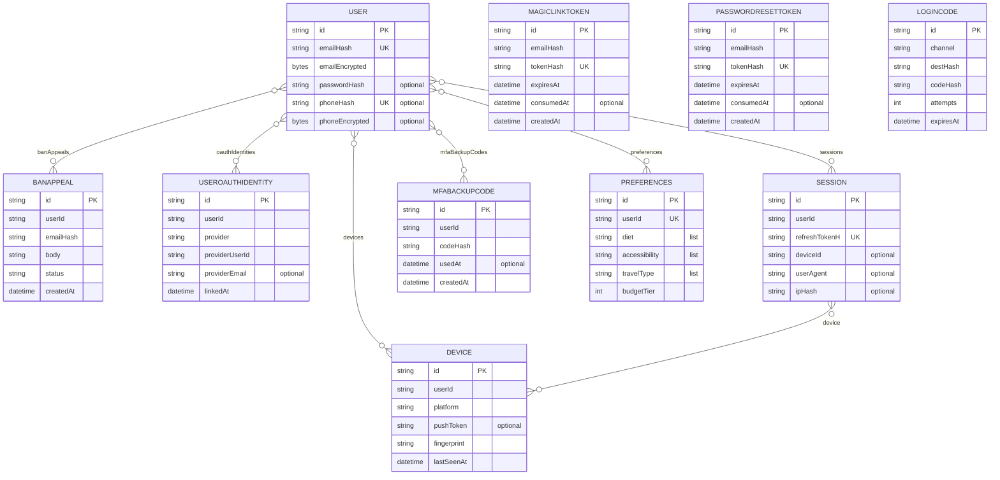
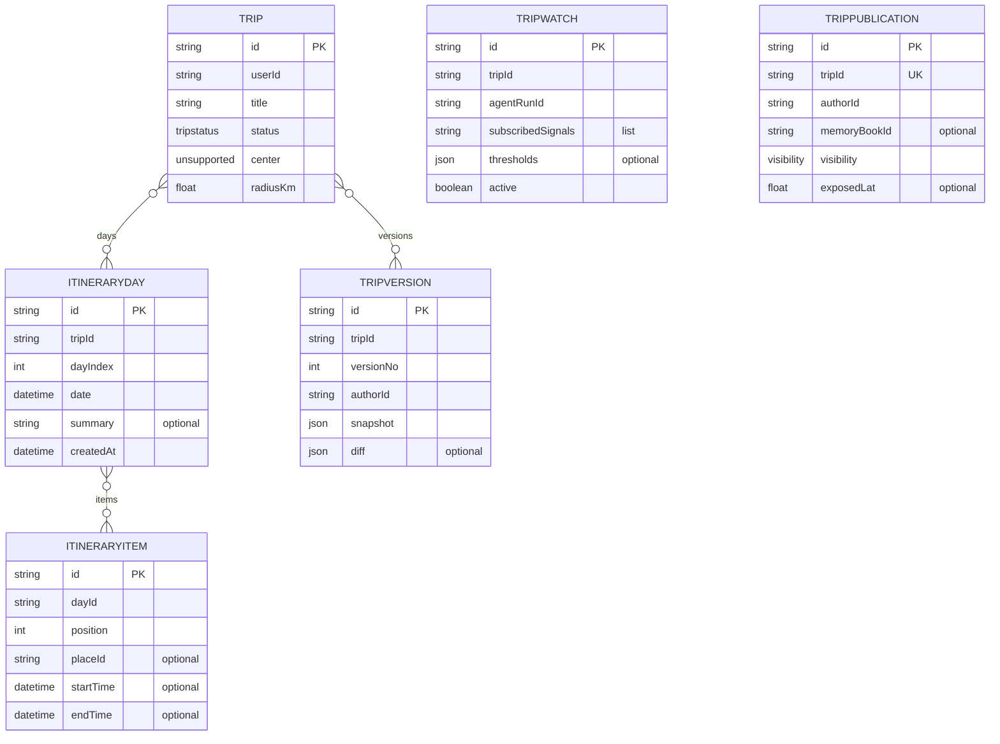
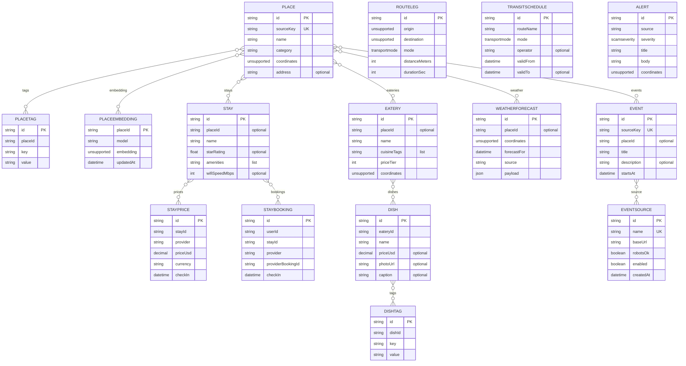
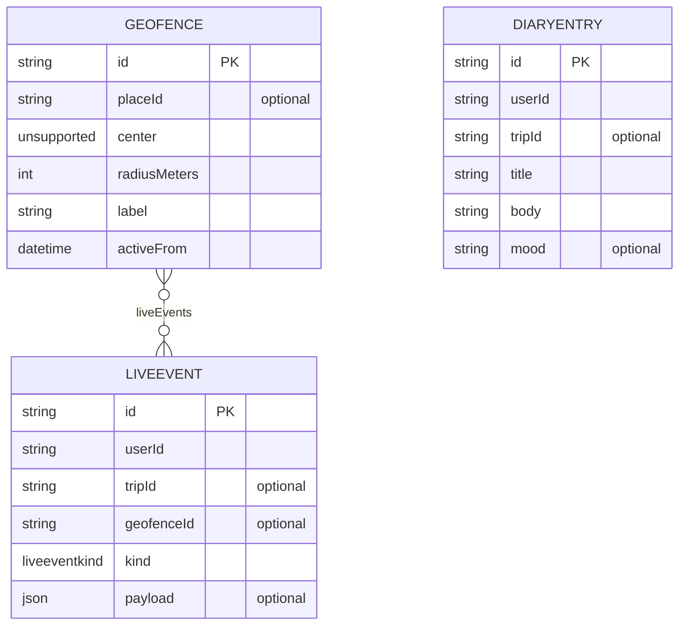
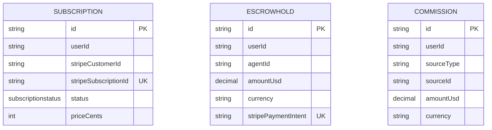

# Data model — ERD

> **Generated** by [`scripts/docs-emit-erd.mjs`](../../scripts/docs-emit-erd.mjs) from [`apps/api/prisma/schema.prisma`](../../apps/api/prisma/schema.prisma). Do NOT edit by hand — re-run `pnpm docs:erd` after a schema change. The CI drift gate fails any PR that touches the schema without regenerating this file.
>
> Models: **64** · Enums: **14** · Clusters: **8** (matches [`c4/components-api.md`](./c4/components-api.md)).

## How to read

- One **Mermaid erDiagram** per cluster — boxes are models, lines are foreign-key relations within the cluster.
- Cardinality on the diagrams is shown as `}o--o{` (generic association) — the precise type lives in [`schema.prisma`](../../apps/api/prisma/schema.prisma); duplicating it here would only invite drift.
- Up to 6 representative scalar/enum fields per box (id + 5). Relation fields are shown as edges, not as box rows.
- **Cross-cluster relations** are listed at the bottom in a table — those are the seams between bounded contexts.

## Model-ownership index (64 models)

| Cluster         | Models                                                                                                                                                                                    |
| --------------- | ----------------------------------------------------------------------------------------------------------------------------------------------------------------------------------------- |
| Identity        | `User`, `BanAppeal`, `UserOAuthIdentity`, `Session`, `MagicLinkToken`, `PasswordResetToken`, `MfaBackupCode`, `Preferences`, `Device`, `LoginCode`                                        |
| Trip            | `Trip`, `ItineraryDay`, `ItineraryItem`, `TripVersion`, `TripWatch`, `TripPublication`                                                                                                    |
| PlaceDiscovery  | `Place`, `PlaceTag`, `PlaceEmbedding`, `Stay`, `StayPrice`, `StayBooking`, `Eatery`, `Dish`, `DishTag`, `RouteLeg`, `TransitSchedule`, `WeatherForecast`, `Alert`, `Event`, `EventSource` |
| Safety          | `CrimeIncident`, `ScamReport`, `Agent`, `SosEvent`, `TrustedContact`, `AgentRun`, `AgentStep`                                                                                             |
| LiveAndDiary    | `Geofence`, `LiveEvent`, `DiaryEntry`                                                                                                                                                     |
| SocialAndMemory | `TripShare`, `Vote`, `Expense`, `Review`, `UserKarma`, `HelpfulVote`, `Follow`, `UserBlock`, `TripComment`, `GamificationProfile`, `EarnedBadge`, `MediaAsset`, `MemoryBook`              |
| Money           | `Subscription`, `EscrowHold`, `Commission`                                                                                                                                                |
| Platform        | `NotificationPreference`, `PushSubscription`, `NotificationLog`, `AdminUser`, `ModerationItem`, `FeatureFlag`, `AdminAuditLog`                                                            |

Maps 1-to-N onto the 17 bounded contexts in [`context-map.md`](./context-map.md) — see "Cluster legend" in [`c4/components-api.md`](./c4/components-api.md) for the mapping.

## Identity

Auth + sessions + preferences + the OAuth / magic-link / password-reset tokens. User is the only model with soft-delete (GDPR erasure cascade is fan-out from Identity.UserDeleted).



## Trip

The itinerary aggregate — Trip owns days, items, immutable versions, and the publish-state shadow (TripWatch, TripPublication).



## PlaceDiscovery

Catalog + decoration of places. Stays / Food / Transport / Weather / Events all hang off Place via geo or context-map ports.



## Safety

Crime + scam DB, the agent verification flow, SOS lifecycle, and the AgentRun / AgentStep audit trail for AI-assisted ops.

```mermaid
erDiagram
    CRIMEINCIDENT {
        string id PK
        string source
        string category
        scamseverity severity
        unsupported coordinates
        datetime reportedAt
    }
    SCAMREPORT {
        string id PK
        string reporterId
        string category
        scamseverity severity
        unsupported coordinates
        string description
    }
    AGENT {
        string id PK
        string userId UK
        string displayName
        string bio "optional"
        agentkycstatus kycStatus
        string kycProviderRef "optional"
    }
    SOSEVENT {
        string id PK
        string userId
        unsupported coordinates
        string trigger
        datetime resolvedAt "optional"
        string resolutionNote "optional"
    }
    TRUSTEDCONTACT {
        string id PK
        string userId
        string name
        string phone "optional"
        string email "optional"
        datetime createdAt
    }
    AGENTRUN {
        string id PK
        string tripId
        agentrunstatus status
        int planVersion
        datetime createdAt
        datetime updatedAt
    }
    AGENTSTEP {
        string id PK
        string agentRunId
        string kind
        json detail "optional"
        datetime createdAt
    }
```



## LiveAndDiary

What runs DURING a trip — geofences fire LiveEvents, which feed the LLM-driven diary writer.



## SocialAndMemory

Sharing, voting, reviews, expenses, follow graph, gamification, and the memory-book composer (media + final PDF).

```mermaid
erDiagram
    TRIPSHARE {
        string id PK
        string tripId
        string ownerId
        string shareCode UK
        boolean publicRead
        datetime expiresAt "optional"
    }
    VOTE {
        string id PK
        string tripId
        string userId
        string targetType
        string targetId
        int value
    }
    EXPENSE {
        string id PK
        string tripId
        string paidById
        decimal amountUsd
        string currency
        string note "optional"
    }
    REVIEW {
        string id PK
        string authorId
        string tripId "optional"
        string targetType
        string targetId
        int rating
    }
    USERKARMA {
        string id PK
        string userId UK
        int score
        int reviewCount
        int helpfulVotesReceived
        string badges "list"
    }
    HELPFULVOTE {
        string id PK
        string reviewId
        string voterId
        datetime createdAt
    }
    FOLLOW {
        string followerId
        string followeeId
        datetime createdAt
    }
    USERBLOCK {
        string blockerId
        string blockedId
        datetime createdAt
    }
    TRIPCOMMENT {
        string id PK
        string tripId
        string authorId
        string body
        datetime createdAt
        datetime updatedAt
    }
    GAMIFICATIONPROFILE {
        string userId PK
        int totalPoints
        int currentStreak
        int longestStreak
        int entryCount
        int aiAssistCount
    }
    EARNEDBADGE {
        string id PK
        string userId
        string badgeKey
        datetime awardedAt
    }
    MEDIAASSET {
        string id PK
        string ownerId
        string tripId "optional"
        string memoryBookId "optional"
        string kind
        mediastatus status
    }
    MEMORYBOOK {
        string id PK
        string ownerId
        string title
        string coverS3Key "optional"
        string theme
        datetime publishedAt "optional"
    }
    REVIEW }o--o{ HELPFULVOTE : "helpfulVotes"
    MEDIAASSET }o--o{ MEMORYBOOK : "memoryBook"
```



## Money

Subscriptions + agent escrow + commission ledger. Stripe is the source of truth; rows here mirror the webhook events.



## Platform

Notifications (prefs + log), admin tooling (users + moderation queue + flags + audit log).

```mermaid
erDiagram
    NOTIFICATIONPREFERENCE {
        string id PK
        string userId UK
        boolean push
        boolean email
        boolean sms
        json quietHours "optional"
    }
    PUSHSUBSCRIPTION {
        string id PK
        string userId
        string endpoint UK
        string p256dh
        string auth
        datetime createdAt
    }
    NOTIFICATIONLOG {
        string id PK
        string userId
        notificationchannel channel
        string templateId
        notificationdeliverystatus status
        string providerMessageId "optional"
    }
    ADMINUSER {
        string id PK
        string email UK
        string passwordHash
        userrole role
        boolean mfaEnabled
        string mfaSecret "optional"
    }
    MODERATIONITEM {
        string id PK
        string targetType
        string targetId
        string reason
        moderationstatus status
        string actorId "optional"
    }
    FEATUREFLAG {
        string id PK
        string name UK
        string description
        boolean enabled
        json rollout "optional"
        datetime createdAt
    }
    ADMINAUDITLOG {
        string id PK
        string actorId "optional"
        string targetType
        string targetId
        string action
        json context "optional"
    }
```



## Cross-cluster relations

These are the foreign keys that cross bounded-context lines — the seams to watch when you refactor a module.

| From cluster   | From model      | →   | To model                 | To cluster      | Field               |
| -------------- | --------------- | --- | ------------------------ | --------------- | ------------------- |
| Identity       | `User`          | →   | `Trip`                   | Trip            | `trips`             |
| Identity       | `User`          | →   | `TripVersion`            | Trip            | `tripVersions`      |
| Identity       | `User`          | →   | `TripShare`              | SocialAndMemory | `tripShares`        |
| Identity       | `User`          | →   | `Vote`                   | SocialAndMemory | `votes`             |
| Identity       | `User`          | →   | `Expense`                | SocialAndMemory | `expenses`          |
| Identity       | `User`          | →   | `Review`                 | SocialAndMemory | `reviews`           |
| Identity       | `User`          | →   | `MediaAsset`             | SocialAndMemory | `mediaAssets`       |
| Identity       | `User`          | →   | `MemoryBook`             | SocialAndMemory | `memoryBooks`       |
| Identity       | `User`          | →   | `Subscription`           | Money           | `subscriptions`     |
| Identity       | `User`          | →   | `EscrowHold`             | Money           | `escrowHolds`       |
| Identity       | `User`          | →   | `Commission`             | Money           | `commissions`       |
| Identity       | `User`          | →   | `ScamReport`             | Safety          | `scamReports`       |
| Identity       | `User`          | →   | `SosEvent`               | Safety          | `sosEvents`         |
| Identity       | `User`          | →   | `TrustedContact`         | Safety          | `trustedContacts`   |
| Identity       | `User`          | →   | `StayBooking`            | PlaceDiscovery  | `stayBookings`      |
| Identity       | `User`          | →   | `NotificationPreference` | Platform        | `notificationPrefs` |
| Identity       | `User`          | →   | `NotificationLog`        | Platform        | `notificationLogs`  |
| Identity       | `User`          | →   | `PushSubscription`       | Platform        | `pushSubscriptions` |
| Identity       | `User`          | →   | `LiveEvent`              | LiveAndDiary    | `liveEvents`        |
| Identity       | `User`          | →   | `Agent`                  | Safety          | `agent`             |
| Identity       | `User`          | →   | `Dish`                   | PlaceDiscovery  | `dishReports`       |
| Identity       | `User`          | →   | `ModerationItem`         | Platform        | `moderationActions` |
| Identity       | `User`          | →   | `AdminAuditLog`          | Platform        | `adminAuditLogs`    |
| Identity       | `User`          | →   | `UserKarma`              | SocialAndMemory | `karma`             |
| Identity       | `User`          | →   | `HelpfulVote`            | SocialAndMemory | `helpfulVotes`      |
| PlaceDiscovery | `Place`         | →   | `Geofence`               | LiveAndDiary    | `geofences`         |
| Safety         | `Agent`         | →   | `EscrowHold`             | Money           | `escrowHolds`       |
| Trip           | `ItineraryItem` | →   | `Place`                  | PlaceDiscovery  | `place`             |
| Trip           | `Trip`          | →   | `TripShare`              | SocialAndMemory | `shares`            |
| Trip           | `Trip`          | →   | `Vote`                   | SocialAndMemory | `votes`             |
| Trip           | `Trip`          | →   | `Expense`                | SocialAndMemory | `expenses`          |
| Trip           | `Trip`          | →   | `Review`                 | SocialAndMemory | `reviews`           |
| Trip           | `Trip`          | →   | `MediaAsset`             | SocialAndMemory | `media`             |
| Trip           | `Trip`          | →   | `LiveEvent`              | LiveAndDiary    | `liveEvents`        |

## Enums

14 enums in [`schema.prisma`](../../apps/api/prisma/schema.prisma): `AgentKycStatus` · `AgentRunStatus` · `EscrowState` · `LiveEventKind` · `MediaStatus` · `ModerationStatus` · `NotificationChannel` · `NotificationDeliveryStatus` · `ScamSeverity` · `SubscriptionStatus` · `TransportMode` · `TripStatus` · `UserRole` · `Visibility`.

## Regenerate

```sh
pnpm docs:erd          # writes this file
pnpm docs:erd:check    # CI drift gate: exits non-zero if regen would change anything
```

## See also

- [`apps/api/prisma/schema.prisma`](../../apps/api/prisma/schema.prisma) — the source of truth
- [`context-map.md`](./context-map.md) — what each module owns + the event surface
- [`c4/components-api.md`](./c4/components-api.md) — visual placement of these clusters
- [`docs/runbooks/supabase-deploy.md`](../runbooks/supabase-deploy.md) — how migrations land in prod
